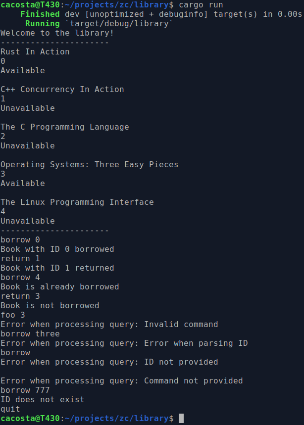

`library.txt` before terminal session:

```
Rust In Action
0
Available

C++ Concurrency In Action
1
Unavailable

The C Programming Language
2
Unavailable

Operating Systems: Three Easy Pieces
3
Available

The Linux Programming Interface
4
Unavailable
```


Terminal session:



`library.txt` after terminal session:

```
Rust In Action
0
Unavailable

C++ Concurrency In Action
1
Available

The C Programming Language
2
Unavailable

Operating Systems: Three Easy Pieces
3
Available

The Linux Programming Interface
4
Unavailable
```